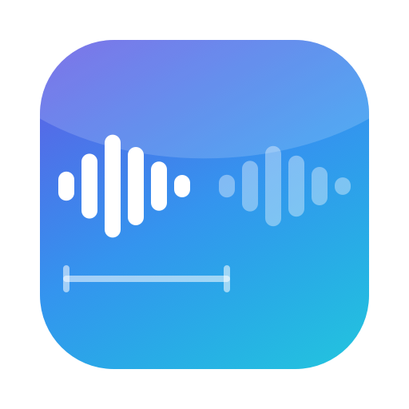
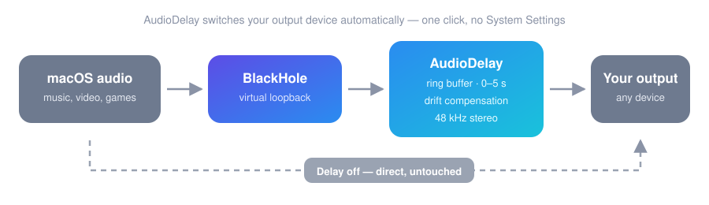

<div align="center">



# AudioDelay

**Delay your Mac's audio output by up to 5 seconds, from the menu bar.**

[](../../releases/latest)

[](https://www.apple.com/macos/)
[]()
[]()
[](LICENSE)

[Install](#install) · [How it works](#how-it-works) · [Troubleshooting](#troubleshooting)

</div>

---

## Why

I wanted to delay my Mac's audio output. macOS can't, and the apps I found were DAWs, dead, or both. So I built this with [Claude](https://claude.ai/code).

Fixes sound arriving before picture: laggy projectors, TVs, streams, wireless headphones.

## Install

Download the [`.dmg`](../../releases/latest) and drag AudioDelay to Applications.

**First launch:** the app isn't notarized, so macOS blocks it once.

- **macOS 15 and later:** open it, dismiss the warning, then System Settings → Privacy & Security → scroll down → **Open Anyway**.
- **macOS 13–14:** right-click AudioDelay, hit **Open**, confirm.

Then it asks for two things:

- **An audio driver.** macOS gives apps no way to capture system audio, so AudioDelay uses [BlackHole](https://github.com/ExistentialAudio/BlackHole). Click Install and it downloads and installs it for you. Needs your admin password, because drivers install system-wide.
- **Microphone permission.** Reading from BlackHole counts as audio input. It never touches your real mic.

Then pick your output device, turn it on, drag the slider. Settings survive reboots.

## How it works

Your Mac plays into BlackHole, AudioDelay reads it back out, holds it, and sends it to your speakers.

<div align="center">

</div>

Off means bypassed. macOS goes straight to your speakers.

BlackHole and your speakers run on separate clocks, so the buffer between them slowly fills or drains. The app trims its read rate by a few parts per million to hold the delay steady, which is far too small to hear.

## Details

- 0 to 5 s, 0.01 s steps, adjustable while playing
- 30 ms crossfade on changes, so no clicks
- Universal binary, ~1.7 MB, no dependencies
- Adds itself to login items
- Goes online exactly once, to fetch the BlackHole installer on first launch

## Troubleshooting

**macOS still refuses to open it.** `xattr -cr /Applications/AudioDelay.app`

**No audio when on.** Check the status line. Green means audio is flowing, so check the device's volume. Orange means macOS isn't routed to BlackHole.

**Denied the microphone prompt.** System Settings → Privacy & Security → Microphone, enable AudioDelay, turn the delay on again.

**Driver install failed.** Install [BlackHole](https://github.com/ExistentialAudio/BlackHole/releases/latest) yourself and reopen AudioDelay. Sometimes needs a reboot to appear.

**Crackling or dropouts.** Raise the output device's buffer size in Audio MIDI Setup.

**Microphone prompt after every rebuild.** The signature changes each build, so macOS sees a new app.

**Unplugged my headphones and it stopped.** It falls back to another device and says so. Reselect yours when it's back.

**It crashed or was force-quit and now there's no sound.** Reopen AudioDelay — it restores the route. Or pick your speakers under System Settings → Sound.

**Surround came out in stereo.** The delay path is stereo. Turn it off for untouched multichannel.

## Building

```bash
swift build -c release
swift test
./build-app.sh              # install to ~/Applications
./build-dmg.sh              # distributable dmg into dist/
./make-icon.swift           # regenerate the icon
```

macOS 13+ and the Command Line Tools. Full Xcode isn't needed: `swift build --arch arm64 --arch x86_64` requires it, building each slice against its own triple and merging with `lipo` doesn't. `swift test` needs an Xcode 16-era toolchain (Swift Testing).

The icon is drawn by `make-icon.swift`, not checked in as an image.

## Limits

Delay path is 48 kHz stereo. Direct mode is untouched. BlackHole 2ch folds surround down; use 16ch if you need the channels.

Small latency floor from the audio chain itself, shown in the panel. The slider approximates perceived delay, not just the buffer.

Releases are ad-hoc signed, not notarized, so updating to a new version re-asks for the microphone permission — macOS sees each build as a new app.

If the login item doesn't take, run `./install-login-item.sh`.

## Credits

[BlackHole](https://github.com/ExistentialAudio/BlackHole) by Existential Audio does the hard part. It isn't bundled here: the source is GPLv3 but the compiled installers are all rights reserved, so AudioDelay downloads the official signed installer instead, pinned to a version and checksum.

## License

MIT, see [LICENSE](LICENSE).
